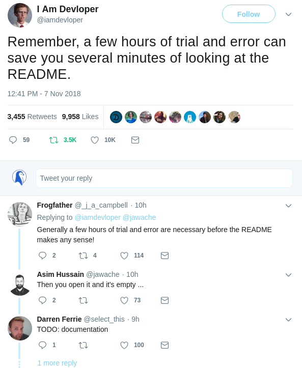

# Redux Learning Resource List

The following is a list of resources I found helpful when I was fist learning redux.
I have tried to structure the resources below in an order that could be effective for learning redux.

## 1. forward / Where to start

Learning a new tech can be a huge pain, what i've found most effective for myself is.

## 1: Start out by reading the docs.

    This will help to give you a general idea of what problem the tech is trying to solve and why you might want to use it.
    Core concepts and best practices for using the tech and usually a tutorial and code examples.
    After reading through the docs a bit i'm usually still left with some unaswered questions though..
    Usually somewhere along the lines of how do I implement this new tech into my app and how are other people using this tech in their apps.

## 2: Time to hit the google for some walkthrough tutorials on scotch.io, medium.com, frontendmasters.com or some youtubes.

  __Dont skip step 1__ 
  `“Have patience. All things are difficult before they become easy.” Saadi`

    Almost every article, walkthrough or video you read/watch will use the tech you are trying to learn effectively.
    Which is awesome but they might not explain something the way you need to hear it or they might start out at a higher or lower level then you were
    expecting and you might end up more confused then when you started. This is why i stress starting with the docs above. 
    a lot of confusion can be avoided by throughly looking through the docs then going onto tutorials.

    It can usually take me reading 1-2 articles _and/or_ watching 2-4 videos for me get a general idea of how best to structure a new tech into my app.
    Be patient with yourself learning a new tech is not easy (especially redux)

## 3: Three words, Apply, Apply, Apply.

`“Knowing is not enough, we must apply. Willing is not enough, we must do.” Johann Wolfgang von Goethe`
